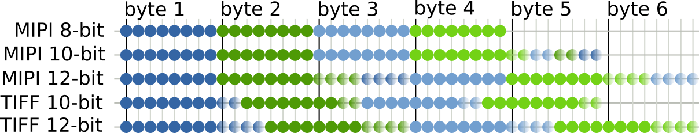

Overview
========

The Adobe DNG standard is the only widely supported open way to exchange raw
camera sensor data between various pieces of software. It uses the TIFF format
to store the sensor data and has a series of custom TIFF tags to describe the
method to convert the raw sensor data to regular RGB color data.

DNG Limitations
---------------

In order to produce valid dng files from sensor data the only valid options are
a grayscale image produced by a camera with a color filter array (a bayer filter)
or raw data which has been demosaiced into a multi-channel color image.

It is not possible to store YUV encoded image data or any of the UVC camera
supported data formats.

Bit packing of sensor data
--------------------------

Most camera sensors that produce raw data connected to a Linux system will be
connected over the MIPI-CSI bus. The MIPI specifications declare several formats
for transmitting the pixel data. For modes where the camera returns 8-bit data
this is exactly what you expect with one byte mapping to one sample. For 16-bit
data it simply maps to two bytes per sample but a lot of sensor data will be
either 10 or 12 bits per sample.

The packing in the MIPI specification is matching to the packed formats in v4l2:
V4L2_PIX_FMT_SBGGR10P and V4L2_PIX_FMT_SBGGR12P and their other 4 corresponding
CFA orders. These formats pack the 8 most significant bits of the 4 samples as
seperate bytes and then 1 or 2 extra bytes that stores all the "leftover" bits.

In the diagram above the first samples from a camera in BGGR mode is shown. The
first line has alternating blue and red color filters here shown in two shades
of blue and green to differentiate the 4 samples. The semi-transparent bits are
the least significant bits of each sample.

The DNG standard specifies a subset of TIFF image data encodings for storing the
sensor data into the DNG. These formats sadly do not line up with the pixel
format of MIPI sensor data like most cameras use. The libdng code provides some
helper code to convert the 10 and 12-bit MIPI pixel formats to the more linear
format used in the TIFF file format.

Writing a simple DNG file
-------------------------

The minimum code for writing a valid DNG file is the following:

.. code-block:: c

   #include <libdng.h>

   // Imagine you have real data
   uint8_t *data = <from somewhere>;
   size_t data_length = 1234;

   // Run once to register custom tags in libtiff
   libdng_init();

   // New image
   libdng_info dng = {0};
   libdng_new(&dng);

   // Set the pixel format to 10-bit RGGB in MIPI format
   if (!libdng_set_mode_from_name(&dng, "SRGGB10P")) {
     fprintf(stderr, "Invalid pixel format supplied\n");
   }

   // Call any other libdng_set_* methods here

   if (!libdng_write(&dng, "out.dng", width, height, data, data_length)) {
     fprintf(stderr, "Could not write DNG\n");
   }

   libdng_free(&dng);

This writes out the raw sensor data from :code:`*data` to the `out.dng` file
with the right metadata for a RGGB color filter array. It also converts the
10-bit packed format to the linear format from the TIFF spec.

Operations that change metadata can be executed in any order between the
:code:`libdng_new` and :code:`libdng_write` command. The ony required metadata
is one of the :code:`libdng_set_mode_*` calls to bring all the pixelformat
metadata in order.

Setting the mode
----------------

The only required metadata operation is setting the pixelformat. There are
multiple ways of specifying the format:

* With :code:`libdng_set_mode_from_name(&dng, "name")`:

  This is setting the format from one of the named modes. The accepted named
  modes here are the 4 character fourcc codes defined by V4L2 and also the
  more intuitively named V4L2 constants without the :code:`V4L2_PIX_FMT_`
  prefix in front.

* With :code:`libdng_set_mode_from_pixfmt(&dng, pixfmt)`:

  This does the same thing but instead of passing the format as string you
  pass the value of the :code:`V4L2_PIX_FMT_` constants as an integer. This is
  easier for integrating the DNG writing with existing V4L2 code.

If the format is one of the packed formats the :code:`libdng_write` method will
automatically convert the format to fit in a TIFF container.